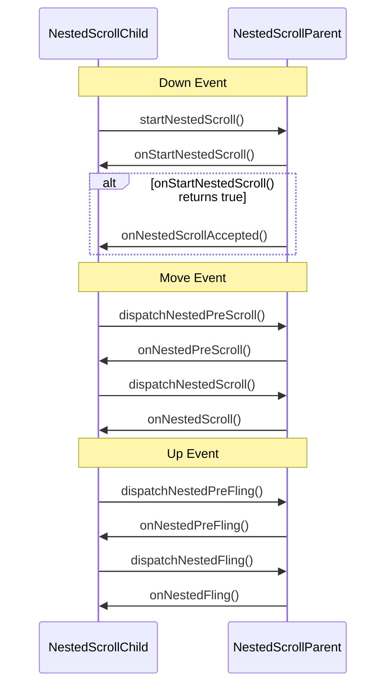

# View 触摸反馈

## MotionEvent

Android 中 MotionEvent 是手指触碰屏幕后产生的事件，它包含了触控事件的坐标，类型等信息。获取 MotionEvent 坐标信息有两种方法：

- getX/getY：获取触摸事件相对于当前 View 左上角的坐标

  ```java
  //获取第一个手指的坐标信息
  public final float getX() {
      return nativeGetAxisValue(mNativePtr, AXIS_X, 0, HISTORY_CURRENT);
  }
  public final float getY() {
      return nativeGetAxisValue(mNativePtr, AXIS_Y, 0, HISTORY_CURRENT);
  }
  
  //获取第pointerIndex个手指的坐标信息
  public final float getX(int pointerIndex) {
      return nativeGetAxisValue(mNativePtr, AXIS_X, pointerIndex, HISTORY_CURRENT);
  }
  public final float getY(int pointerIndex) {
      return nativeGetAxisValue(mNativePtr, AXIS_Y, pointerIndex, HISTORY_CURRENT);
  }
  ```

- getRawX/getRawY：获取触摸事件相对于屏幕左上角的坐标

  ```java
  //获取第一个手指的坐标信息
  public final float getRawX() {
      return nativeGetRawAxisValue(mNativePtr, AXIS_X, 0, HISTORY_CURRENT);
  }
  public final float getRawY() {
      return nativeGetRawAxisValue(mNativePtr, AXIS_Y, 0, HISTORY_CURRENT);
  }
  
  //获取第pointerIndex个手指的坐标信息
  public final float getRawX(int pointerIndex) {
      return nativeGetAxisValue(mNativePtr, AXIS_X, pointerIndex, HISTORY_CURRENT);
  }
  public final float getRawY(int pointerIndex) {
      return nativeGetAxisValue(mNativePtr, AXIS_Y, pointerIndex, HISTORY_CURRENT);
  }
  ```

### Action/ActionMasked

单指触控的事件类型分为：

- ACTION_DOWN：手指初次触碰到屏幕触发
- ACTION_UP：手指最后一个离开屏幕触发
- ACTION_MOVE：手指在屏幕上移动触发
- ACTION_CANCEL：事件先交给当前 View处理， 染后又被上层拦截时触发

多指触控事件类型在单指触控的基础上，丰富了记录手指的功能，增加了以下事件类型：

- ACTION_POINTER_DOWN：非第一个手指按下
- ACTION_POINTER_UP：非第一个手指抬起

可以通过 getAction()/getActionMasked() 可以获取触控事件类型：

- getAction() 方法返回一个 int 类型的值，共有 32 位（0x00000000），最低 8 位(0x000000**ff**) 表示事件类型，再往前的 8 位(0x0000**ff**00) 表示事件手指编号。

- getActionMasked() 方法是对 getAction() 的结果进行过滤，只取事件类型。

```java
public final int getAction() {
    return nativeGetAction(mNativePtr);
}

public static final int ACTION_MASK = 0x00000ff;
public final int getActionMasked() {
    return nativeGetAction(mNativePtr) & ACTION_MASK;
}
```

### PointIndex

可以通过 getActionIndex() 对 getAction() 的结果进行过滤来获取触控事件的手指编号，但这个方法在 ACTION_MOVE 事件中是失效的，因为在手指移动时，getAction() 返回值永远是 0x00000002，没有手指编号信息。

```java
public static final int ACTION_POINTER_INDEX_MASK  = 0x0000ff00;
public static final int ACTION_POINTER_INDEX_SHIFT = 8;
public final int getActionIndex() {
    return (nativeGetAction(mNativePtr) & ACTION_POINTER_INDEX_MASK) >> ACTION_POINTER_INDEX_SHIFT;
}
```

getActionIndex() 获取到的 PointIndex 是会发生变化的，变化规律有以下几个特点：

1. 从 0 开始，自动正常
2. 如果之前落下的手指抬起，后面的手指 Index 就会减小
3. Index 的变化趋向于第一次落下的数值

### PointId

因为 PointIndex 会变化，所以在触控事件处理过程中，为了追踪某个手指，都会通过 getPointerId() 获取触控事件手指 PointId，PointId 是一个从手指按下到手指抬起都不会变换的值，用做手指的唯一值，不会受到其他手指抬起和落下的影响。

```java
public final int getPointerId(int pointerIndex) {
    return nativeGetPointerId(mNativePtr, pointerIndex);
}
```

保存好需要追踪的 PointId 后，在需要获取该手指的事件坐标需要传入 PointIndex，就可以通过 findPointerIndex 从 PointId 查找到 PointIndex。

```java
public final int findPointerIndex(int pointerId) {
    return nativeFindPointerIndex(mNativePtr, pointerId);
}
```

## 触控事件分发流程

### 从屏幕到 ViewRootImpl

系统启动时，在 SystemServer 进程会启动管理事件输入的 InputManagerService。在 ViewRootImpl.setView() 中处理触控事件：

- 创建 InputChannel 实例，建立 InputManagerService 和 WindowManagerService 的联系
- 创建 WindowInputEventReceiver 实例，接收触控事件回调
- 创建 InputStage 处理链 mFirstPostImeInputStage&mFirstInputStage，View 的触控事件就在 ViewPostImeInputStage 中
- WindowInputEventReceiver 的 onInputEvent 回调中通过 InputStage 链表处理数据
- InputStage 链表处理数据完成后调用 finishInputEvent() 通知 SystemServer 进程将该事件移除

```java
public final class ViewRootImpl {
  public void setView(View view, WindowManager.LayoutParams attrs, View panelParentView) {
      ...
      // 创建InputChannel
      mInputChannel = new InputChannel();
      // 通过Binder在SystemServer进程中完成InputChannel的注册
      mWindowSession.addToDisplay(mWindow, mSeq, mWindowAttributes,
                            getHostVisibility(), mDisplay.getDisplayId(),
                            mAttachInfo.mContentInsets, mAttachInfo.mStableInsets,
                            mAttachInfo.mOutsets, mInputChannel);
      ...
      if (inputChannel != null) {
        if (mInputQueueCallback != null) {
            mInputQueue = new InputQueue();
            mInputQueueCallback.onInputQueueCreated(mInputQueue);
        }
        //接收触控事件回调
        mInputEventReceiver = new WindowInputEventReceiver(inputChannel, Looper.myLooper());
	  }
      ...
      //设置触控事件处理链 mFirstPostImeInputStage&mFirstInputStage
      mSyntheticInputStage = new SyntheticInputStage();
      InputStage viewPostImeStage = new ViewPostImeInputStage(mSyntheticInputStage);
      InputStage nativePostImeStage = new NativePostImeInputStage(viewPostImeStage, "aq:native-post-ime:" + counterSuffix);
      InputStage earlyPostImeStage = new EarlyPostImeInputStage(nativePostImeStage);
      InputStage imeStage = new ImeInputStage(earlyPostImeStage, "aq:ime:" + counterSuffix);
      InputStage viewPreImeStage = new ViewPreImeInputStage(imeStage);
      InputStage nativePreImeStage = new NativePreImeInputStage(viewPreImeStage, "aq:native-pre-ime:" + counterSuffix);
      mFirstInputStage = nativePreImeStage;
      mFirstPostImeInputStage = earlyPostImeStage;
   }
    
	final class WindowInputEventReceiver extends InputEventReceiver {
		public void onInputEvent(InputEvent event) {
			...
			enqueueInputEvent(event, this, 0, true); 
		}
		
		void enqueueInputEvent(InputEvent event, InputEventReceiver receiver, int flags, boolean processImmediately) {
			...
			doProcessInputEvents();
		}
		
		void doProcessInputEvents() {
			...
			mChoreographer.mFrameInfo.updateInputEventTime(eventTime, oldestEventTime);
			deliverInputEvent(q);
		}
		
		private void deliverInputEvent(QueuedInputEvent q) {
			...
			InputStage stage = q.shouldSkipIme() ? mFirstPostImeInputStage : mFirstInputStage;
			if (stage != null) {
				handleWindowFocusChanged();
                 //ViewPostImeInputStage 处理触控事件
				stage.deliver(q);
			} else {
                 //通知 SystemServer 进程将该事件移除
				finishInputEvent(q);
			}
		}
	}
}
```

mFirstPostImeInputStage&mFirstInputStage 链表用于处理输入，总的来说是经过 综合性处理 → 视图处理 → 本地处理 → 输入法预处理 → 输入法处理 → 视图预处理 → 输入法本地预处理，View 的触控处理就是在视图预处理 ViewPostImeInputStage 中：

- SyntheticInputStage。综合处理事件阶段，比如处理导航面板、操作杆等事件。
- ViewPostImeInputStage。视图输入处理阶段，比如按键、手指触摸等运动事件，我们熟知的view事件分发就发生在这个阶段。
- NativePostImeInputStage。本地方法处理阶段，主要构建了可延迟的队列。
- EarlyPostImeInputStage。输入法早期处理阶段。
- ImeInputStage。输入法事件处理阶段，处理输入法字符。
- ViewPreImeInputStage。视图预处理输入法事件阶段，调用视图view的dispatchKeyEventPreIme方法。
- NativePreImeInputStage。本地方法预处理输入法事件阶段。

### 从 ViewRootImpl 到 Activity

在 ViewPostImeInputStage 的 onProcess() 中判断如果是触控事件 isTouchEvent() 会按照以下顺序处理：

- DecorView.dispatchTouchEvent()
- Activity.dispatchTouchEvent() 
- PhoneWindow.superDispatchTouchEvent()
- DecorView.superDispatchTouchEvent()
- ViewGroup.dispatchTouchEvent()

```java
//ViewPostImeInputStage.java
protected int onProcess(QueuedInputEvent q) {
    if ((source & InputDevice.SOURCE_CLASS_POINTER) != 0) {
             return processPointerEvent(q);
         }
}
protected int onProcess(QueuedInputEvent q) {
	if ((source & InputDevice.SOURCE_CLASS_POINTER) != 0) {
		return processPointerEvent(q);
	}
	
	private int processPointerEvent(QueuedInputEvent q) {
		final MotionEvent event = (MotionEvent)q.mEvent;
		boolean handled = mView.dispatchPointerEvent(event);
	}
}

//DecorView.java
public final boolean dispatchPointerEvent(MotionEvent event) {
    if (event.isTouchEvent()) {
        return dispatchTouchEvent(event);
    } else {
        return dispatchGenericMotionEvent(event);
    }
}

public boolean dispatchTouchEvent(MotionEvent ev) {
    final Window.Callback cb = mWindow.getCallback();
    return cb != null && !mWindow.isDestroyed() && mFeatureId < 0
            ? cb.dispatchTouchEvent(ev) : super.dispatchTouchEvent(ev);
}

//Activity.java
//如果PhoneWindow不处理的话，最终会调用Activity.onTouchEvent()处理
public boolean dispatchTouchEvent(MotionEvent ev) {
    if (getWindow().superDispatchTouchEvent(ev)) {
        return true;
    }
    return onTouchEvent(ev);
}

//PhoneWindow.java
public boolean superDispatchTouchEvent(MotionEvent event) {
    return mDecor.superDispatchTouchEvent(event);
}

//DecorView.java
//调用ViewGroup.dispatchTouchEvent()
public boolean superDispatchTouchEvent(MotionEvent event) {
    return super.dispatchTouchEvent(event);
}
```

### ViewGroup 触控事件分发

ViewGroup 的事件分发机制实际上是一个责任链模式，整个过程逻辑如下，共涉及到三个重要方法：

```java
public boolean dispatchTouchEvent(MotionEvent event){
    boolean result = false;
    // onInterceptTouchEvent判断当前ViewGroup是否拦截event
    if(!onInterceptTouchEvent(event)){
        //如果不拦截，event就交给子View处理
        result = child.dispatchTouchEvent(event);
    }
    // 如果event被拦截或者子View没有处理，由当前ViewGroup.onTouchEvent处理
    if(!result){
        //onTouchEvent表示是否消耗当前事件
        result = onTouchEvent(event);
    }
    //返回结果表示是否消耗当前事件
    return result;
}
```

ViewGroup 中触控事件分发 dispatchTouchEvent() 整体流程大致如下：

- ACTION_DOWN 标志着一个事件的开始，重置 ViewGroup 的 mFirstTouchTarget 等状态
- 判断当前 ViewGroup 是否拦截事件，设置变量 intercepted
- 判断事件是否是 Cancel 事件，设置变量 canceled
- 在 (!canceled && !intercepted) 条件下，ACTION_DOWN 事件会遍历子 View 是否消耗事件，如果消耗事件，新建 mFirstTouchTarget 实例
- 如果 mFirstTouchTarget 为空，说明子 View 不消耗事件，由当前 ViewGroup 消耗事件
- 如果 mFirstTouchTarget 不为空，后续其他事件也会交给对应子 View 处理

```java
public boolean dispatchTouchEvent(MotionEvent ev) {
	...
	boolean handled = false;
	if (onFilterTouchEventForSecurity(ev)) {
		final int action = ev.getAction();
		final int actionMasked = action & MotionEvent.ACTION_MASK;
		//ACTION_DOWN事件重置状态
		if (actionMasked == MotionEvent.ACTION_DOWN) {
			cancelAndClearTouchTargets(ev);
			resetTouchState();
		}
		//1.如果是ACTION_DOWN事件，标志着一个事件序列的开始
		//2.其他事件，如果mFirstTouchTarget != null 说明已经有子View处理
		//以上两种条件满足一个，就检查当前ViewGroup是否拦截事件
		final boolean intercepted;
		if (actionMasked == MotionEvent.ACTION_DOWN
				|| mFirstTouchTarget != null) {
			//第二种情况，如果子View.requestDisallowInterceptTouchEvent()设置不允许父view拦截，直接设置为不拦截
			//否则根据当前ViewGroup.onInterceptTouchEvent()返回值，设置是否拦截
			final boolean disallowIntercept = (mGroupFlags & FLAG_DISALLOW_INTERCEPT) != 0;
			if (!disallowIntercept) {
				intercepted = onInterceptTouchEvent(ev);
				ev.setAction(action);
			} else {
				intercepted = false;
			}
		} else {
			//非ACTION_DOWN且mFirstTouchTarget=null，没有子View处理，直接设置为拦截
			intercepted = true;
		}
		...
		//检查MotionEvent是否是Cancel事件
		final boolean canceled = resetCancelNextUpFlag(this)
				|| actionMasked == MotionEvent.ACTION_CANCEL;
		TouchTarget newTouchTarget = null;
		...
		//不是Cancel事件且不会拦截事件，向View传递
		if (!canceled && !intercepted) {
			//如果是ACTION_DOWN事件，表明是触控事件系列开始，开始遍历查找子View是否消耗
			if (actionMasked == MotionEvent.ACTION_DOWN
					|| (split && actionMasked == MotionEvent.ACTION_POINTER_DOWN)
					|| actionMasked == MotionEvent.ACTION_HOVER_MOVE) {
				...
				final int actionIndex = ev.getActionIndex()
				final int childrenCount = mChildrenCount;
				if (newTouchTarget == null && childrenCount != 0) {
					...
					final View[] children = mChildren;
					//遍历所有子View，判断View是否能接收事件
					for (int i = childrenCount - 1; i >= 0; i--) {
						...
                          //isTransformedTouchPointInView会把当前ViewGroup的scrollX/scrollY 和 Matrix 转换坐标，判断触控事件是够在子View内
                          if (!child.canReceivePointerEvents()
                                  || !isTransformedTouchPointInView(x, y, child, null)) {
                              continue;
                          }
						//dispatchTransformedTouchEvent第三个参数不为空，将触控事件传给子View
						//如果子View消耗了触控事件，返回true
						if (dispatchTransformedTouchEvent(ev, false, child, idBitsToAssign)) {
							...
							//将消耗了触控事件的子View，设置为newTouchTarget和mFirstTouchTarget
							newTouchTarget = addTouchTarget(child, idBitsToAssign);
							alreadyDispatchedToNewTouchTarget = true;
							break;
						}
					}
				}
				...
			}
		}
		//mFirstTouchTarget == null 有两种情况
		//1.当前ViewGroup在ACTION_DOWN时，就拦截了整个触控事件
		//2.遍历子View，都没有处理触控事件
		if (mFirstTouchTarget == null) {
			//dispatchTransformedTouchEvent第三个参数为空，将触控事件传给自己
			handled = dispatchTransformedTouchEvent(ev, canceled, null,
					TouchTarget.ALL_POINTER_IDS);
		} else {
			//mFirstTouchTarget有值，说明触控事件有View处理
			TouchTarget predecessor = null;
			TouchTarget target = mFirstTouchTarget;
			while (target != null) {
				final TouchTarget next = target.next;
				//ACTION_DOWN上面已经处理过了
				if (alreadyDispatchedToNewTouchTarget && target == newTouchTarget) {
					handled = true;
				} else {
					//其他类型的触控事件，判断是否当前ViewGroup会拦截
					final boolean cancelChild = resetCancelNextUpFlag(target.child)
							|| intercepted;
					//cancelChild=true，dispatchTransformedTouchEvent会把MotionEvent.ACTION_CANCEL事件传给之前处理触控的子View
					//cancelChild=false，dispatchTransformedTouchEvent会把当前触控事件传给之前处理触控的子View
					if (dispatchTransformedTouchEvent(ev, cancelChild,
							target.child, target.pointerIdBits)) {
						handled = true;
					}
					//cancelChild=true，会把mFirstTouchTarget重置为null，表示没有子View处理
					if (cancelChild) {
						if (predecessor == null) {
							mFirstTouchTarget = next;
						} else {
							predecessor.next = next;
						}
						target.recycle();
						target = next;
						continue;
					}
				}
				predecessor = target;
				target = next;
			}
		}
		...
	}
	return handled;
}
```

在整个分发过程中，dispatchTransformedTouchEvent() 方法承担了多个重要的任务：

- 分发触控事件给子 View 处理，并将 MotionEvent 的坐标进行了转换
- 分发触控事件给自己处理
- 将原来的触控事件类型改为 ACTION_CANCEL 分发给子View

```java
private boolean dispatchTransformedTouchEvent(MotionEvent event, boolean cancel,
        View child, int desiredPointerIdBits) {
    final boolean handled;
    // 如果参数cancel=true，就把触控事件类型改为ACTION_CANCEL
    final int oldAction = event.getAction();
    if (cancel || oldAction == MotionEvent.ACTION_CANCEL) {
        event.setAction(MotionEvent.ACTION_CANCEL);
        // 如果参数child=null，就把触控事件传给自己处理
        if (child == null) {
            //super.dispatchTouchEvent是View的dispatchTouchEvent
            handled = super.dispatchTouchEvent(event);
        } else {
            handled = child.dispatchTouchEvent(event);
        }
        event.setAction(oldAction);
        return handled;
    }
    ...
    final MotionEvent transformedEvent = MotionEvent.obtain(event);
    //如果参数child=null，就把触控事件传给自己处理
    if (child == null) {
        //super.dispatchTouchEvent是View的dispatchTouchEvent
        handled = super.dispatchTouchEvent(transformedEvent);
    } else {
        // 将ViewGroup自身的ScrollX/ScrollY修正
        final float offsetX = mScrollX - child.mLeft;
        final float offsetY = mScrollY - child.mTop;
        transformedEvent.offsetLocation(offsetX, offsetY);
        // 将ViewGroup自身的Matrix修正
        if (! child.hasIdentityMatrix()) {
            transformedEvent.transform(child.getInverseMatrix());
        }
        handled = child.dispatchTouchEvent(transformedEvent);
    }
    transformedEvent.recycle();
    return handled;
}
```

### View 触控事件分发

在 dispatchTransformedTouchEvent() 中调用了 ViewGroup.super.dispatchTouchEvent(event)，就会将触控事件传给 ViewGroup 自身处理，也就是 View.dispatchTouchEvent()，整体流程大致如下：

- ACTION_DOWN 先停止滑动
- 事件交给 OnTouchListener 处理，如果处理了就返回 true，否则继续向后执行
- 事件交给 View.onTouchEvent() 处理，如果处理了就返回 true，否则返回 false，说明当前 View 不处理事件

```java
public boolean dispatchTouchEvent(MotionEvent event) {
    ...
    boolean result = false;
    // 如果是 ACTION_DOWN 先停止滑动
    final int actionMasked = event.getActionMasked();
    if (actionMasked == MotionEvent.ACTION_DOWN) {
        stopNestedScroll();
    }
    if (onFilterTouchEventForSecurity(event)) {
        // 如果开发者设置了 OnTouchListener，并返回 ture 拦截了事件，就设置 result = true
        ListenerInfo li = mListenerInfo;
        if (li != null && li.mOnTouchListener != null
                && (mViewFlags & ENABLED_MASK) == ENABLED
                && li.mOnTouchListener.onTouch(this, event)) {
            result = true;
        }
        // OnTouchListener没有设置或者返回 false 没有拦截，就调用当前View 的 onTouchEvent
        // 如果返回 ture 拦截了事件，就设置 result = true
        if (!result && onTouchEvent(event)) {
            result = true;
        }
    }
    if (actionMasked == MotionEvent.ACTION_UP ||
            actionMasked == MotionEvent.ACTION_CANCEL ||
            (actionMasked == MotionEvent.ACTION_DOWN && !result)) {
        stopNestedScroll();
    }
    return result;
}
```

View.onTouchEvent() 中涉及了处理单击，长按，按下等操作的监控逻辑：

- ACTION_DOWN 设置按下状态，并发送判断长按的延迟操作
- ACTION_UP 如果长按没有触发，移除长按的延迟监听，执行点击操作 performClick()
- ACTION_UP 如果长按触发，执行长按操作 performLongClick()

```java
public boolean onTouchEvent(MotionEvent event) {
    final float x = event.getX();
    final float y = event.getY();
    final int viewFlags = mViewFlags;
    final int action = event.getAction();
    //判断当前View是否可点击，不可点击的View不会消耗事件
    final boolean clickable = ((viewFlags & CLICKABLE) == CLICKABLE
            || (viewFlags & LONG_CLICKABLE) == LONG_CLICKABLE)
            || (viewFlags & CONTEXT_CLICKABLE) == CONTEXT_CLICKABLE;
    //不可用状态还是会消耗点击事件，返回值依赖于是否可点击
    if ((viewFlags & ENABLED_MASK) == DISABLED) {
        if (action == MotionEvent.ACTION_UP && (mPrivateFlags & PFLAG_PRESSED) != 0) {
            setPressed(false);
        }
        mPrivateFlags3 &= ~PFLAG3_FINGER_DOWN;
        return clickable;
    }
    //TouchDelegate是在不改变View大小的情况下，增加View的点击面积，内部点击逻辑和View的类似
    if (mTouchDelegate != null) {
        if (mTouchDelegate.onTouchEvent(event)) {
            return true;
        }
    }
    //如果当前View可点击，开始具体的处理
    if (clickable || (viewFlags & TOOLTIP) == TOOLTIP) {
        switch (action) {
            case MotionEvent.ACTION_UP:
                boolean prepressed = (mPrivateFlags & PFLAG_PREPRESSED) != 0;
                if ((mPrivateFlags & PFLAG_PRESSED) != 0 || prepressed) {
                    // 如果当前View长按的事件在postDelay中还没有触发
                    // mHasPerformedLongPress是false
                    if (!mHasPerformedLongPress && !mIgnoreNextUpEvent) {
                        // 移除长按监听
                        removeLongPressCallback();
                        if (!focusTaken) {
                            // PerformClick实现Runnable，内部执行performClick()方法
                            // performClick中如果OnClickListener不为空，就返回true拦截事件
                            if (mPerformClick == null) {
                                mPerformClick = new PerformClick();
                            }
                            if (!post(mPerformClick)) {
                                performClick();
                            }
                        }
                    }
                    if (mUnsetPressedState == null) {
                        mUnsetPressedState = new UnsetPressedState();
                    }
                    // UnsetPressedState 实现 Runnable，若干时间后 setPressed(false)
                    if (prepressed) {
                        postDelayed(mUnsetPressedState, ViewConfiguration.getPressedStateDuration());
                    } else if (!post(mUnsetPressedState)) {
                        mUnsetPressedState.run();
                    }
                    removeTapCallback();
                }
                mIgnoreNextUpEvent = false;
                break;
            case MotionEvent.ACTION_DOWN:
                if (event.getSource() == InputDevice.SOURCE_TOUCHSCREEN) {
                    mPrivateFlags3 |= PFLAG3_FINGER_DOWN;
                }
                mHasPerformedLongPress = false;
                boolean isInScrollingContainer = isInScrollingContainer();
                if (isInScrollingContainer) {
                    // 如果当前View在滚动的View中，CheckForTap继承Runnable，
                    // 用于若干时间后注册长按点击监听checkForLongClick
                    mPrivateFlags |= PFLAG_PREPRESSED;
                    if (mPendingCheckForTap == null) {
                        mPendingCheckForTap = new CheckForTap();
                    }
                    mPendingCheckForTap.x = event.getX();
                    mPendingCheckForTap.y = event.getY();
                    postDelayed(mPendingCheckForTap, ViewConfiguration.getTapTimeout());
                } else {
                    // 设置当前View为被按下状态
                    setPressed(true, x, y);
                    // 创建CheckForLongPress对象也是继承Runnable
                    // 在若干时间后 postDelay 出去执行performLongClick并设置 mHasPerformedLongPress = true;
                    checkForLongClick(0, x, y);
                }
                break;
            case MotionEvent.ACTION_CANCEL:
                if (clickable) {
                    setPressed(false);
                }
                removeTapCallback();
                removeLongPressCallback();
                mInContextButtonPress = false;
                mHasPerformedLongPress = false;
                mIgnoreNextUpEvent = false;
                mPrivateFlags3 &= ~PFLAG3_FINGER_DOWN;
                break;
            case MotionEvent.ACTION_MOVE:
                //绘制波纹效果
                if (clickable) {
                    drawableHotspotChanged(x, y);
                }
                //如果离开的View区域，移除长按等延迟监听
                if (!pointInView(x, y, mTouchSlop)) {
                    //重置按下状态，当抬起时就不会响应click事件
                    removeTapCallback();
                    //移除长按动作
                    removeLongPressCallback();
                    if ((mPrivateFlags & PFLAG_PRESSED) != 0) {
                        setPressed(false);
                    }
                    mPrivateFlags3 &= ~PFLAG3_FINGER_DOWN;
                }
                break;
        }
        // 只要当前 View 可点击，就会返回 true，消耗事件
        return true;
    }
    return false;
}
```

## 滑动冲突

Android 中滑动冲突是指当一个父 ViewGroup 包含多个可滑动的子 View 时，子 View 之间的滑动会互相影响，导致滑动不流畅或者无法滑动的现象。这种情况下，滑动事件会被多个子 View 捕获并处理，导致滑动效果不如用户预期。常见的滑动冲突包括水平滑动和垂直滑动之间的冲突、多指触控之间的冲突等。解决滑动冲突一般有外部拦截法和内部拦截法两种方法解决。

### 外部拦截法

外部拦截法核心思想重写外部 ViewGroup.onInterceptTouchEvent()，根据外部 ViewGroup 是否处理来决定是否拦截，大致流程如下：点击事件都先经过父 View 的拦截处理，如果需要就拦截，如果不需要就不拦截。

- ACTION_DOWN 事件记录 MotionEvent 坐标等相关数据，返回 false

- ACTION_MOVE 事件根据外部 View 是否处理，返回 true 或 false，如果返回 true，内部 View 会收到 cancel 事件

- ACTION_UP 一般返回 false

```java
// 父view.java      
@Override
public boolean onInterceptTouchEvent(MotionEvent ev) {
    boolean intercepted = false;
    boolean parentCanIntercept;

    switch (ev.getActionMasked()) {
        case MotionEvent.ACTION_DOWN:
            intercepted = false;
            break;
        case MotionEvent.ACTION_MOVE:
            if (parentCanIntercept) {
                intercepted = true;
            } else {
                intercepted = false;
            }
            break;
        case MotionEvent.ACTION_UP:
            intercepted = false;
            break;
    }
    return intercepted;
}
```

### 内部拦截法

内部拦截法核心思想是重写外部 ViewGroup.onInterceptTouchEvent() 和内部 View.dispatchTouchEvent()，事件默认由内部 View 处理，如果不处理，再由外部 ViewGroup 处理，大致流程如下：

- 外部 ViewGroup.onInterceptTouchEvent() ACTION_DOWN 记录 MotionEvent 坐标等相关数据，返回 false 不拦截，其他事件返回 true 拦截
- 内部 ViewdispatchTouchEvent() ACTION_DOWN 调用 parent.requestDisallowInterceptTouchEvent(true) 不允许外部 View 拦截事件
- 内部 ViewdispatchTouchEvent() ACTION_MOVE 如果内部不处理，调用parent.requestDisallowInterceptTouchEvent(false) 许外部 View 拦截事件，而外部 ViewGroup 非 DOWN 事件都默认拦截，就交给外部 ViewGroup 处理

```java
// 父view.java            
@Override
public boolean onInterceptTouchEvent(MotionEvent ev) {
    if (ev.getActionMasked() == MotionEvent.ACTION_DOWN) {
        return false;
    } else {
        return true;
    }
}

// 子view.java
@Override
public boolean dispatchTouchEvent(MotionEvent event) {
    boolean parentCanIntercept;
    
    switch (event.getActionMasked()) {
        case MotionEvent.ACTION_DOWN:
            getParent().requestDisallowInterceptTouchEvent(true);
            break;
        case MotionEvent.ACTION_MOVE:
            getParent().requestDisallowInterceptTouchEvent(!parentCanIntercept);
            break;
        case MotionEvent.ACTION_UP:
            break;
    }
    return super.dispatchTouchEvent(event);
}
```

### 嵌套滑动

上面的两种滑动冲突解决方案，在嵌套滑动时，无法做到父 View 和子 View 连贯的滑动。因为 Android 提供了新的 API 用于处理平滑的嵌套滑动。嵌套滑动机制提供了两个接口 NestedScrollParent 和 NestedScrollChild，让需要支持嵌套滑动的 View 去实现不同情形下如何处理事件。

NestedScrollChild 接口的调用顺序是：

- 确保在滚动过程中，按照正确的顺序调用嵌套滚动方法。在开始滚动之前调用 startNestedScroll()，在实际滚动之前调用 dispatchNestedPreScroll()，滚动后调用 dispatchNestedScroll()，最后在滚动结束时调用 stopNestedScroll()。
- 在实际滚动之前，调用 dispatchNestedPreScroll() 以允许父 View 首先消耗滚动距离。处理返回值时，需要考虑父 View 消耗的滚动距离，并相应地更新自定义 View 的滚动距离。
- 在处理 fling 操作时，先调用 dispatchNestedPreFling()，然后根据返回值决定是否继续处理 fling。如果返回值为 true，则表示父 View 已经消耗了 fling，子 View 不需要进一步处理。如果返回值为 false，则子 View 应继续处理 fling，并在处理完毕后调用 dispatchNestedFling()。

```java
public interface NestedScrollingChild {
    /**
     * @param enabled 开启或关闭嵌套滑动
     */
    void setNestedScrollingEnabled(boolean enabled);

    /**
     * @return 返回是否开启嵌套滑动
     */    
    boolean isNestedScrollingEnabled();

    /**
     * 沿着指定的方向开始滑动嵌套滑动
     * @param axes 滑动方向(SCROLL_AXIS_NONE, SCROLL_AXIS_HORIZONTAL, SCROLL_AXIS_VERTICAL)
     * @return 返回是否找到NestedScrollingParent配合滑动
     */
    boolean startNestedScroll(@ScrollAxis int axes);

    /**
     * 停止嵌套滑动
     */
    void stopNestedScroll();

    /**
     * @return 返回是否有配合滑动NestedScrollingParent
     */
    boolean hasNestedScrollingParent();

    /**
     * 滑动完成后，将已经消费、剩余的滑动值分发给NestedScrollingParent
     * @param dxConsumed 水平方向消费的距离
     * @param dyConsumed 垂直方向消费的距离
     * @param dxUnconsumed 水平方向剩余的距离
     * @param dyUnconsumed 垂直方向剩余的距离
     * @param offsetInWindow 含有View从此方法调用之前到调用完成后的屏幕坐标偏移量，
     * 可以使用这个偏移量来调整预期的输入坐标（即上面4个消费、剩余的距离）跟踪，此参数可空。
     * @return 返回该事件是否被成功分发
     */
    boolean dispatchNestedScroll(int dxConsumed, int dyConsumed,
            int dxUnconsumed, int dyUnconsumed, @Nullable int[] offsetInWindow);

    /**
     * 在滑动之前，将滑动值分发给NestedScrollingParent
     * @param dx 水平方向消费的距离
     * @param dy 垂直方向消费的距离
     * @param consumed 输出坐标数组，consumed[0]为NestedScrollingParent消耗的水平距离、
     * consumed[1]为NestedScrollingParent消耗的垂直距离，此参数可空。
     * @param offsetInWindow 同上dispatchNestedScroll
     * @return 返回NestedScrollingParent是否消费部分或全部滑动值
     */
    boolean dispatchNestedPreScroll(int dx, int dy, @Nullable int[] consumed,
            @Nullable int[] offsetInWindow);

    /**
     * 将惯性滑动的速度和NestedScrollingChild自身是否需要消费此惯性滑动分发给NestedScrollingParent
     * @param velocityX 水平方向的速度
     * @param velocityY 垂直方向的速度
     * @param consumed NestedScrollingChild自身是否需要消费此惯性滑动
     * @return 返回NestedScrollingParent是否消费全部惯性滑动
     */
    boolean dispatchNestedFling(float velocityX, float velocityY, boolean consumed);

    /**
     * 在惯性滑动之前，将惯性滑动值分发给NestedScrollingParent
     * @param velocityX 水平方向的速度
     * @param velocityY 垂直方向的速度
     * @return 返回NestedScrollingParent是否消费全部惯性滑动
     */
    boolean dispatchNestedPreFling(float velocityX, float velocityY);
}
```

NestedScrollingParent 接口的调用顺序是：

- 在 onStartNestedScroll() 方法中，根据滚动方向和子 View 的状态决定是否接受嵌套滚动请求
- 子 View 开始滚动时调用 onStartNestedScroll()，接受滚动请求时调用 onNestedScrollAccepted()，滚动前调用 onNestedPreScroll()，滚动后调用 onNestedScroll()，最后在滚动结束时调用 onStopNestedScroll()
- 处理 fling 操作：在 onNestedPreFling() 和 onNestedFling() 方法中，根据子 View 的 fling 操作调整父 View 的行为

```
public interface NestedScrollingParent {
    /**
     * 对NestedScrollingChild发起嵌套滑动作出应答
     * @param child 布局中包含下面target的直接父View
     * @param target 发起嵌套滑动的NestedScrollingChild的View
     * @param axes 滑动方向(SCROLL_AXIS_NONE, SCROLL_AXIS_HORIZONTAL, SCROLL_AXIS_VERTICAL)
     * @return 返回NestedScrollingParent是否配合处理嵌套滑动
     */
    boolean onStartNestedScroll(@NonNull View child, @NonNull View target, @ScrollAxis int axes);

    /**
     * NestedScrollingParent接受嵌套滚动请求时调用。可以在此方法中执行一些初始化操作。
     * @param child 布局中包含下面target的直接父View
     * @param target 发起嵌套滑动的NestedScrollingChild的View
     * @param axes 滑动方向(SCROLL_AXIS_NONE, SCROLL_AXIS_HORIZONTAL, SCROLL_AXIS_VERTICAL)
     */
    void onNestedScrollAccepted(@NonNull View child, @NonNull View target, @ScrollAxis int axes);

    /**
     * 嵌套滑动结束
     * @param target 同上
     */
    void onStopNestedScroll(@NonNull View target);

    /**
     * NestedScrollingChild滑动完成后将滑动值分发给NestedScrollingParent回调此方法
     * @param target 同上
     * @param dxConsumed 水平方向消费的距离
     * @param dyConsumed 垂直方向消费的距离
     * @param dxUnconsumed 水平方向剩余的距离
     * @param dyUnconsumed 垂直方向剩余的距离
     */
    void onNestedScroll(@NonNull View target, int dxConsumed, int dyConsumed,
            int dxUnconsumed, int dyUnconsumed);

    /**
     * NestedScrollingChild滑动完之前将滑动值分发给NestedScrollingParent回调此方法
     * @param target 同上
     * @param dx 水平方向的距离
     * @param dy 水平方向的距离
     * @param consumed 返回NestedScrollingParent是否消费部分或全部滑动值
     */
    void onNestedPreScroll(@NonNull View target, int dx, int dy, @NonNull int[] consumed);

    /**
     * NestedScrollingChild在惯性滑动之前，将惯性滑动的速度和NestedScrollingChild自身是否需要消费此惯性滑动分
     * 发给NestedScrollingParent回调此方法
     * @param target 同上
     * @param velocityX 水平方向的速度
     * @param velocityY 垂直方向的速度
     * @param consumed NestedScrollingChild自身是否需要消费此惯性滑动
     * @return 返回NestedScrollingParent是否消费全部惯性滑动
     */
    boolean onNestedFling(@NonNull View target, float velocityX, float velocityY, boolean consumed);

    /**
     * NestedScrollingChild在惯性滑动之前,将惯性滑动的速度分发给NestedScrollingParent
     * @param target 同上
     * @param velocityX 同上
     * @param velocityY 同上
     * @return 返回NestedScrollingParent是否消费全部惯性滑动
     */
    boolean onNestedPreFling(@NonNull View target, float velocityX, float velocityY);

    /**
     * @return 返回当前嵌套滑动的方向
     */
    int getNestedScrollAxes();
}
```

综合上面的流程，NestedScrollChild 和 NestedScrollParent 整体的调用流程是：

- DOWN 事件
  - NestedScrollChild.startNestedScroll() child开启滑动
  - NestedScrollParent.onStartNestedScroll() 确定 parent 是否接受这个嵌套滚动请求
  - NestedScrollParent.onNestedScrollAccepted() parent 初始化操作
- MOVE 事件
  - NestedScrollChild.dispatchNestedPreScroll() child 滑动事件传给 parent 预处理
  - NestedScrollParent.onNestedPreScroll() parent 预处理滑动事件
  - NestedScrollChild.dispatchNestedScroll() child 处理滑动事件
  - NestedScrollParent.onNestedScroll() parent 处理滑动事件
- UP 事件
  - NestedScrollChild.dispatchNestedPreFling() child 惯性滑动事件传给 parent 预处理
  - NestedScrollParent.onNestedPreFling() parent 预处理惯性滑动事件
  - NestedScrollChild.dispatchNestedFling() child 处理惯性滑动事件
  - NestedScrollParent.onNestedFling() parent 处理惯性滑动事件




[【带着问题学】Android事件分发8连问 (qq.com)](https://mp.weixin.qq.com/s?__biz=MzA5MzI3NjE2MA==&mid=2650262749&idx=1&sn=7a2726d9927f4866f1548e0dce1dcefc&chksm=88633db2bf14b4a4a34f4bc0a6b5d2687bb4330d52ab0805e06321f6c6690277bf675bf3e07d)

[Android 事件分发中你可能忽略掉的点！ (qq.com)](https://mp.weixin.qq.com/s?__biz=MzAxMTI4MTkwNQ==&mid=2650837456&idx=2&sn=d84c1609414788a490ba743e80f90d7d&chksm=80b7454eb7c0cc587a0da43520acb56521f5c3ac29d5aa95b956c1c52dacc2b7a9f42f79f466)

[Android事件分发机制详解：史上最全面、最易懂 - 简书 (jianshu.com)](https://www.jianshu.com/p/38015afcdb58)

[安卓自定义View进阶-事件分发机制详解 (gcssloop.com)](http://www.gcssloop.com/customview/dispatch-touchevent-source.html)

[安卓自定义View进阶-MotionEvent详解 (gcssloop.com)](http://www.gcssloop.com/customview/motionevent.html)

[安卓自定义View进阶-特殊控件的事件处理方案 (gcssloop.com)](http://www.gcssloop.com/customview/touch-matrix-region.html)

[安卓自定义View进阶-多点触控详解 (gcssloop.com)](http://www.gcssloop.com/customview/multi-touch.html)

[一个解决滑动冲突的新思路，无缝嵌套滑动 (qq.com)](https://mp.weixin.qq.com/s?__biz=MzA5MzI3NjE2MA==&mid=2650263545&idx=1&sn=50ab0a558ff77be6779c86496d6dfc91&chksm=88633e96bf14b7808dfa6fee8501dae95ad4bf32eef0285f15b43491597e5f19bd738fb5b95d)

[Android嵌套滑动，我用NestedScrollView (qq.com)](https://mp.weixin.qq.com/s?__biz=MzA5MzI3NjE2MA==&mid=2650263010&idx=1&sn=7dfde4010a6d1723ad75d2364395a2d3&chksm=88633c8dbf14b59ba73dc21fe2542771018e11036deacb3aa43f5a18309223ee788449be08dc)
